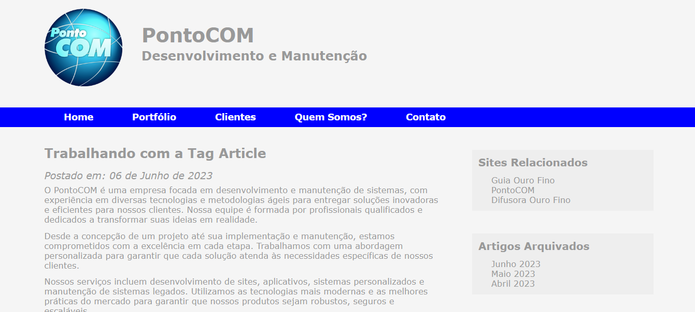
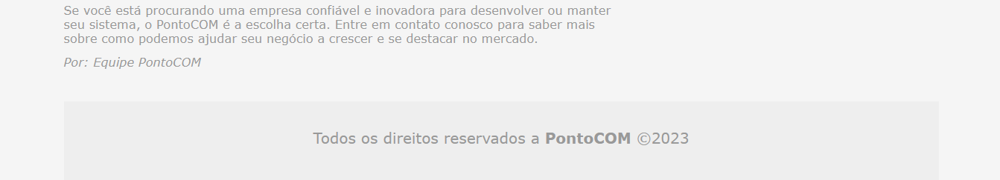

# PORTFOLIO PONTOCOM
👨‍🏫PROJETO CRIADO PARA O CURSO DE JQUERY.

  
  

## DESCRIÇÃO:
O projeto "PontoCOM" é um website informativo e corporativo para uma empresa fictícia especializada em desenvolvimento e manutenção de sites. O objetivo deste projeto é demonstrar a utilização de diversas tecnologias e conceitos de desenvolvimento web, incluindo HTML5, CSS3, e jQuery. 

## ESTRUTURA DO PROJETO:
- **Topo do Site**: Contém o logotipo e o título da empresa, dando uma identidade visual ao site.
- **Menu de Navegação**: Proporciona uma navegação fácil e intuitiva para os usuários, permitindo acesso às principais seções do site como Home, Portfólio, Clientes, Quem Somos e Contato.
- **Corpo do Site**: Inclui um artigo demonstrativo que utiliza a tag `<article>`, com informações sobre os serviços oferecidos pela empresa, data de postagem e conteúdo detalhado.
- **Barra Lateral (Aside)**: Apresenta links para sites relacionados e artigos arquivados, proporcionando recursos adicionais e conteúdo relevante aos visitantes.
- **Rodapé**: Inclui informações de direitos autorais e a identidade da empresa.

## NÃO SABE?
- Entendemos que para manipular arquivos em `HTML`, `CSS` e outras linguagens relacionadas, é necessário possuir conhecimento nessas áreas. Para auxiliar nesse aprendizado, oferecemos cursos gratuitos disponíveis:
* [CURSO DE HTML E CSS](https://github.com/VILHALVA/CURSO-DE-HTML-E-CSS)
* [CURSO DE JAVASCRIPT](https://github.com/VILHALVA/CURSO-DE-JAVASCRIPT)
* [CONFIRA MAIS CURSOS](https://github.com/VILHALVA?tab=repositories&q=+topic:CURSO)

## CREDITOS:
- [PROJETO CRIADO PARA O CURSO DE JQUERY](https://github.com/VILHALVA/CURSO-DE-JQUERY)
- [PROJETO FEITO PELO VILHALVA](https://github.com/VILHALVA)